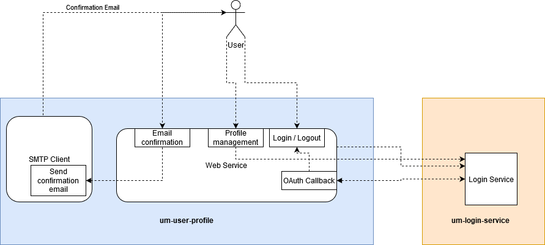
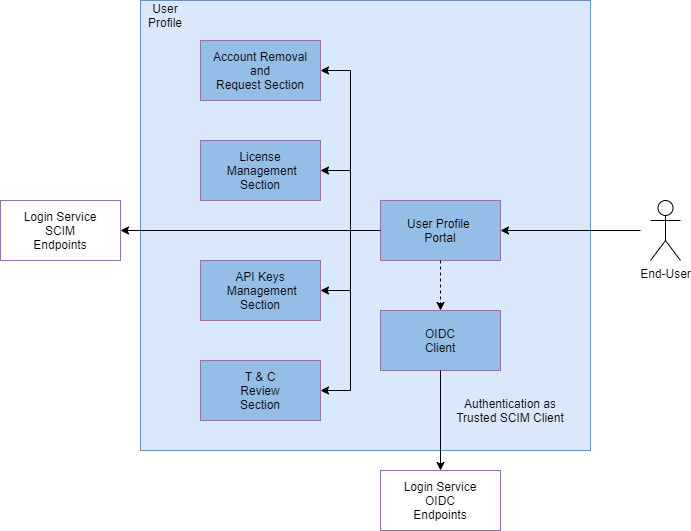
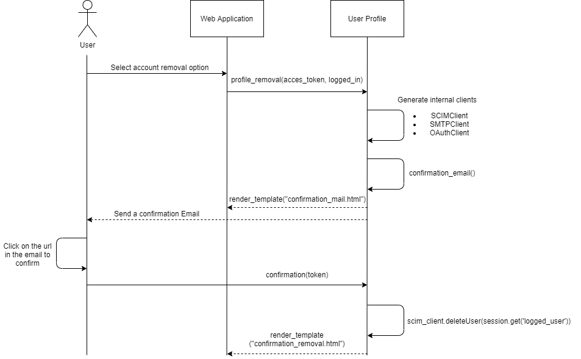
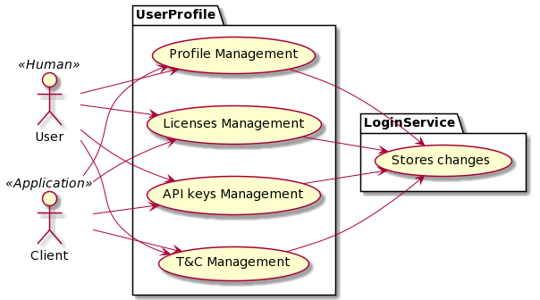

[[mainOverview]]
= Overview

== Building Block Overview

[NOTE]
.Content Description
================================
This section contains:

* High-Level Description of the Building Block
* Context within EOEPCA
================================

In order to support the Billing Service, the User Profile building block allows to identify users (leaving a reference to their home IdP), to assign them Billing Identities, Service API keys, License keys and to record Terms and Conditions acceptance. It's a persistence service with interfaces that will be queried by other building blocks (License Manager, Billing Service, Policy Decision Point) and modified by both the License Manager and the Login Service (during creation of a new user profile or assignment of new Licenses).

The figure below, identifies the main workflows on which the User Profile participates, along with it's components:

Based on this workflows, the User Profile enables the following functionality aspects

=== OIDC Client in User Profile

The User Profile will mainly use the OIDC Client functionality in the User Profile Portal in order to provide Client authentication and End-User authentication functionality according to the OpenIDConnect Authentication Code Flow.

This functionality is provided by a custom script to manage the oauth standard and uses the python WellKnownHandler library that allows for simple parsing and usage of an SSO server's "well-known" endpoints.

=== Send confirmation Email

This functionality allows you to send an email and notify the user that the account will be deleted. In addition, by clicking on the link in the email the user will confirm the action. This functionality is provided by smtp standards for gluu and custom scripts.

The code within the SMTP is dedicated to prepare both the url to proceed with the account removal and the html that will be in the body of the email.
With this it will make the whole process of creating the SMPT Server connection, generating the message and finally sends the email. Previously we need to have configured the mail that will send the email, choosing the mail (Google Account) and the password to access, which are in the Dockerfile as a container variable.

=== Account removal

The functionality related to the account removal is implemented thanks to a SCIM Client that allow querying for user information, update User Profiles based on the assignment of a specific license or in this case a account removal previously created and the two previously mentioned functionalities.

=== API Keys List

It's a feature that allows the user to modify their own list of API keys. It is implemented using the SCIM Client that allows to perform attribute modifications and checks against the Login Service OIDC Auth.

=== Licenses List

It's a feature that allows the user to modify their own list of Licenses the same way the API Keys List above is defined. It is implemented using the SCIM Client that allows to perform attribute modifications and checks against the Login Service OIDC Auth.

=== List of Terms and Conditions

It's a feature that allows the user to modify their own list of Documents of T&C the same way the API Keys List and Licenses manager above is defined. It is implemented using the SCIM Client that allows to perform attribute modifications and checks against the Login Service OIDC Auth.

=== Storage Details

This section defines a list of Object Storage bucket URI where the Storage Details of each User are saved. This attribute is multi-valued within Gluu and it's represented as a list, the same way the others attributes are saved, it will use the SCIM Client in order to perform those modifications. It also makes use of the OAuth Client to resolve authentication, but in a different way than the previous attribute editors: since this information will only be accesible by operators, the OAuth Client will check if the attribute isOperator is set to True for the user that want access to the Storage Details front page.

== Static Architecture

[NOTE]
.Content Description
================================
This section contains:

* Diagram and description of the major logical components within the Building Block

================================

The User Profile, heavily relies on Free and Open Source Software that already implements the interfaces and functionality required. The following image depicts the Static Architecture of this Building Block.

[#img_userProfileDiagram,reftext='{figure-caption} {counter:figure-num}']

* The Authentication and Authorization Service enables both OIDC and UMA flows for the whole Platform
* The User Profile Portal with SCIM Implementation, allowing direct interaction with the End-User Back-End, in this case, the account removal
* A connection to an SMTP Email server for sending confirmation emails, using at the moment a Google Account.

The Section for the Building Block Design <<Design>> contains detailed descriptions and references to the Open Source components used in this Building Block.

== Use Cases

[NOTE]
.Content Description
================================
This section contains:

* Diagrams and definition of the use cases covered by this Building Block

================================

=== USP_UC_001: Use Case: Account Removal

The user is capable deleting their own account

[#img_userProfileUseCaseRemoval,reftext='{figure-caption} {counter:figure-num}']

** Principal actor: User
** Preconditions:
*** The user must be signed in to perform the action
** Postconditions:
*** The user's account will be removed
** Main successful scenario:
*** The user logs in to the platform
*** The user selects the option to remove account
*** The user will receive a confirmation email
*** When the user clicks on the url in the email will confirm the action of account removal

This diagram covers the following use cases:

=== USP_UC_002: Profile Management

The user is capable of modifying their own profile attributes

** Principal actor: User
** Preconditions:
*** The user must be signed in to perform the action
** Postconditions:
*** The user's attributes are modified
** Main successful scenario:
*** The user logs in to the platform
*** The user selects the option for profile management
*** The user can edit attribute fields
*** The changes are saved within the Login Service

=== USP_UC_003: Licenses Management

The user is capable of managing their own licenses

** Principal actor: User
** Preconditions:
*** The user must be signed in to perform the action
** Postconditions:
*** The user's licenses are available
** Main successful scenario:
*** The user logs in to the platform
*** The user selects the option for licenses
*** The user can view, add and delete licenses
*** The changes are saved within the Login Service

=== USP_UC_004: API Keys Management

The user is capable of managing their own API keys

** Principal actor: User
** Preconditions:
*** The user must be signed in to perform the action
** Postconditions:
*** The user's API keys are available
** Main successful scenario:
*** The user logs in to the platform
*** The user selects the option for API keys
*** The user can view, add and delete API keys
*** The changes are saved within the Login Service

=== USP_UC_005: Terms & Conditions Management

The user is capable of managing their own T&C

** Principal actor: User
** Preconditions:
*** The user must be signed in to perform the action
** Postconditions:
*** The user's T&C are available
** Main successful scenario:
*** The user logs in to the platform
*** The user selects the option for Terms & Conditions
*** The user can view, add and delete T&C values
*** The changes are saved within the Login Service

== External Interfaces

[NOTE]
.Content Description
================================
This section contains:

* Listing of technical external interfaces (with other Building Blocks)

================================

=== um-login-service Interface

* Identity Management Interface: The User Profile uses a System for Cross Domain Identity (SCIM) Interface through a .well-known URI that describes all standard endpoints provided by um-login-service building block.
* Authentication (AuthN) Interface: The User Profile uses an OpenID Connect interface through a .well-known URI that describes all standard endpoints provided by um-login-service building block.

=== Web Interface

A web service is made available for users to perform actions related to the building block, such as account removal.

=== SMTP Interface

The User Profile building block uses SMTP client in order to implement all the functionality related to sending confirmation emails.

* How to configure the account for sending emails

** If you want to select the email you want to use to send these emails you must update the Dockerfile, changing the values of the variables EMAIL_ADRESS for the account you want to use and EMAIL_PASSWORD for the account password. Note that the value for EMAIL_PASSWORD should be an app password to make it easy and avoid problems (https://support.google.com/accounts/answer/185833?hl=en)

== Required Resources

[NOTE]
.Content Description
================================
This section contains:

* List of HW and SW required resources for the correct functioning of the building Block
* References to open repositories (when applicable)

================================

=== Software

The following Open-Source Software is required to support the deployment and integration of the Login Service:

* Authentication and Authorization Service
** oxAuth - Gluu Inc. (https://github.com/GluuFederation/oxAuth)
* SSO server's "well-known" endpoints
** Python library: WellKnownHandler (https://pypi.org/project/WellKnownHandler/)
* Email Service
** SMTP Client python library: smtplib (https://docs.python.org/3/library/smtplib.html)
** Email settings library: email (https://docs.python.org/3/library/email.html#module-email)
* Deployment, Configuration and Integration Tooling
** Kubernetes secret and config Tooling (https://github.com/kubernetes/kubernetes)
